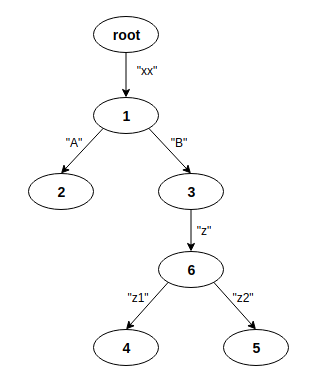

# xradix

A fast, clean, tested, and documented implementation of the [Radix Tree](https://en.wikipedia.org/wiki/Radix_tree) data structure.

Also, comes with special hooks for various tree-traversals starting at the first node matching a given prefix. These include depth-first (pre-order and post-order) and breadth-first.

This data structure is simple and 

## Examples

```{javascript}
const { RadixTree } = require('xradix');

const rt = new RadixTree();
rt.set("xx",     1);        // equivalently,
rt.set("xxA",    2);        //
rt.set("xxB",    3);        // new RadixTree([
rt.set("xxBzz1", 4);        //   ["xx",     1], ["xxA",    2], ["xxB",  3],
rt.set("xxBzz2", 5);        //   ["xxBzz1", 4], ["xxBzz2", 5], ["xxBz", 6]
rt.set("xxBz",   6);        // ]) 
```

which creates this tree:

